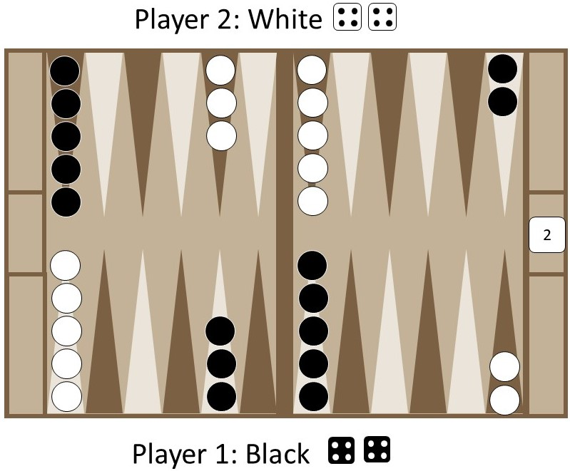

# Artifact 3 - How to Play Backgammon
### Using DITA, Oxygen, and GitHub

You can view the website [*here*](https://pages.github.umn.edu/rich1426/TBackgammon/index.html).
You can view a PDF version of the instructions [*here*](https://drive.google.com/file/d/1rUJGePtJF7RGLWpSWkeOcUhS4tisxekN/view?usp=sharing).

DITA is an information classification and organization system, where information is broken up into its smallest units, called topics. Each topic is completed seperately, then combined to form a final product. The topics can be de-and-re-constructed at will to create whole sets of information. I enjoyed the DITA assignment because of the thought process behind DITA itself - creating many building blocks of information then stacking them into a higher purpose is a really interesting idea that could be incredibly useful when note-taking, or even beginning the writing process.

Even though I faced some difficulties during the process that I needed to ask for help to solve, I believe that I have learned more about how to approach website creation software. Overall, I enjoyed using DITA/Oxygen, and I like the website I created. 

<figcaption>Image that I created for Backgammon instructions website</figcaption>
