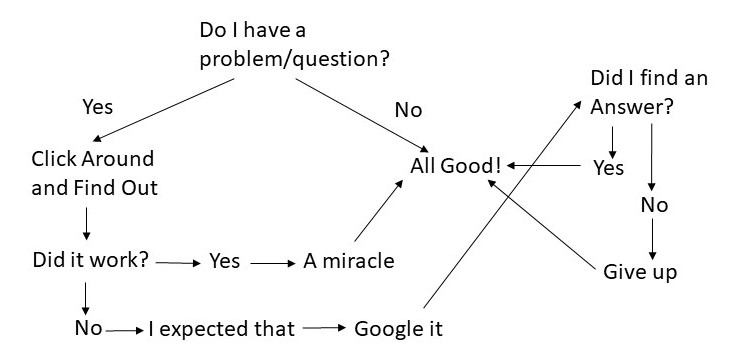

# Artifact 1 - My Digital Literacy Narrative 
### Using Google Sites

You can view my Google Sites [*here*](https://sites.google.com/umn.edu/richardson-diglitnarrative/home).

This google site is the first website that I created, both in the course and my life. I enjoyed the process of making the site - it reminded me of creating images and diagrams in PowerPoint. 

The main focus of the website is my total lack of digital literacy.My digital literacy map that I made for the website was meant to clearly display my lack of confidence with difital technology in a near-comical way. 

<figcaption>Personal Learning Network Flowchart that I created as a part of the Digital Literacy Narrative assignment</figcaption>

Throughout the course, I feel that I have deinitely improved my ability to learn and use digital literacy skills, although I still do not think that I could be described as being digitally literate. My largest piece of acquired knowledge was the importance of looking for and using system manuals when trying to solve problems. 
